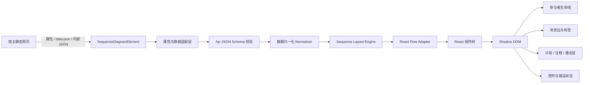
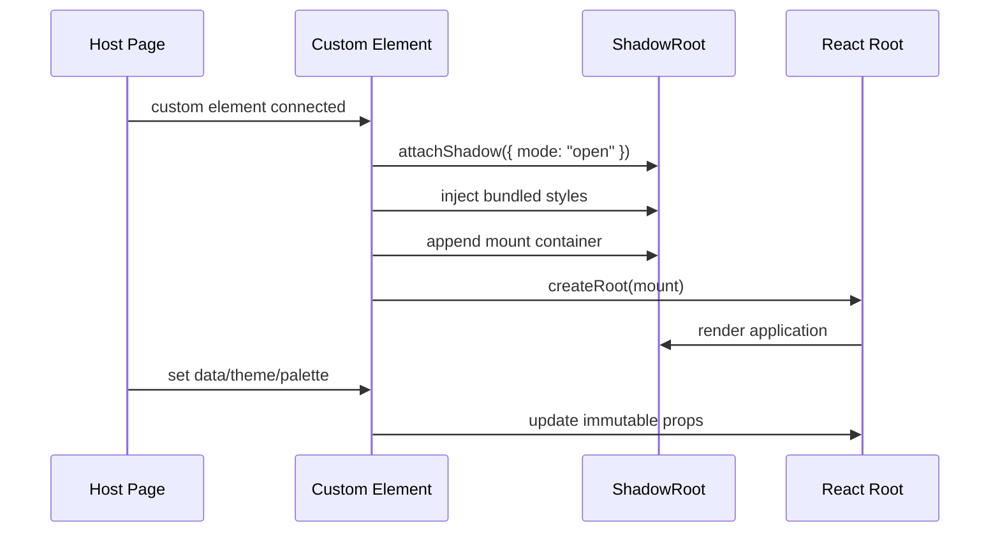

# Sequence Diagram Web Component 实施方案

> 文档用途：交给编程 Agent 直接实施  
> 技术核心：React + TypeScript + React Flow（`@xyflow/react`）+ Web Components + Shadow DOM  
> 目标运行环境：现代桌面与移动浏览器中的静态网页  
> 文档日期：2026-07-18

---

## 0. 模块名称

本模块名称为 `seq_show_case`

## 1. 项目概述

实现一个专门展示 **Sequence Diagram（时序图）** 的 Web Component。宿主网页通过 JSON 向组件传入参与者、消息、注释、激活区间和组合片段等数据，组件将其转换为基于 React Flow 的时序图。

组件必须：

- 注册为原生自定义元素，例如 `<sequence-diagram>`。
- 使用开放模式 Shadow DOM（`mode: "open"`）隔离内部 DOM 和 CSS。
- 可直接嵌入普通静态 HTML，不要求宿主网页使用 React、Vue 或其他框架。
- 所有运行依赖和必需样式都包含在构建产物内，不要求宿主网页另外加载 React Flow CSS。
- 支持 `light`、`dark`、`system` 三种色彩模式。
- 内置至少 6 套配色方案。
- 支持同一页面创建多个相互独立的组件实例。
- 提供完整的 `example.html`，演示数据传入、主题切换、配色切换、事件监听、动态更新和错误处理。

本组件第一版定位为 **只读、可缩放、可平移、可交互查看的时序图展示器**，不是图形编辑器。

---

## 2. 项目目标与非目标

### 2.1 第一版目标

1. 用结构化 JSON 表达常见时序图元素。
2. 确定性地将 JSON 转换成水平参与者列和垂直事件时间轴。
3. 支持以下主要元素：
   - 参与者/角色。
   - 同步消息。
   - 异步消息。
   - 返回消息。
   - 自调用消息。
   - 注释。
   - 激活条。
   - 分隔符。
   - `alt`、`opt`、`loop`、`par`、`critical`、`break` 组合片段。
4. 支持平移、滚轮缩放、双击或按钮适配视图。
5. 支持节点和消息点击事件，但不允许用户拖动参与者或修改连线。
6. 支持响应式容器和 `ResizeObserver`。
7. 提供完整的 JSON 校验和可读错误提示。
8. 提供主题、配色和 CSS 变量覆盖机制。
9. 提供单元测试、浏览器组件测试和视觉回归测试。

### 2.2 第一版非目标

以下能力不要在第一版实现，除非所有核心验收标准完成后仍有余量：

- 可视化拖拽编辑器。
- Mermaid/PlantUML 文本解析。
- 服务端渲染。
- 自动保存和协作编辑。
- PNG/PDF 导出。
- SVG 导出。
- 任意 HTML 标签或富文本消息。
- 动态创建/销毁参与者的完整 UML 语义。
- 远程 URL 自动加载 JSON。
- 对 Internet Explorer 或旧版浏览器的兼容。

---

## 3. 推荐技术栈

| 类别 | 选择 | 说明 |
|---|---|---|
| 语言 | TypeScript（严格模式） | 所有公共 API、JSON 模型、内部布局模型必须有类型定义 |
| UI | React | 仅在 Shadow DOM 内部使用，宿主无需 React |
| 图形视口 | `@xyflow/react` v12 | 负责缩放、平移、节点、边、视口适配和坐标变换 |
| Web Component | 原生 `HTMLElement` | 不引入 Lit 等额外运行时 |
| 构建 | Vite Library Mode | 输出 ESM 和 IIFE 两种独立构建 |
| JSON 校验 | Ajv + JSON Schema Draft 2020-12 | 在运行时给出字段路径和错误原因 |
| 单元测试 | Vitest | 校验、归一化、布局和主题逻辑 |
| 组件/E2E | Playwright | Shadow DOM、交互、静态页面和视觉测试 |
| 代码质量 | ESLint + Prettier | 构建和 CI 中强制执行 |

### 3.1 版本策略

- `@xyflow/react` 使用 v12 的当前稳定小版本，并在 `package-lock.json` 或等效锁文件中锁定。
- 不在源代码中依赖未公开的 React Flow 内部 API。
- React、React DOM 和 React Flow 默认打包进 standalone 构建，保证静态网页开箱即用。
- 可额外输出 npm/peer-dependency 构建，但不得影响 standalone 构建的交付。

---

## 4. 总体架构



### 4.1 模块边界

1. **Web Component Wrapper**
   - 管理 Custom Element 生命周期。
   - 读取 attributes 和 properties。
   - 创建 Shadow Root、React Root 和内部挂载点。
   - 将内部 React 事件转换为 DOM `CustomEvent`。

2. **Schema & Validation**
   - 定义公共 JSON Schema。
   - 校验数据类型、必填字段、ID 唯一性和引用关系。
   - 返回结构化错误，不直接抛出未处理异常。

3. **Normalizer**
   - 为缺失的可选字段补默认值。
   - 将嵌套片段转换成统一事件树。
   - 建立参与者索引、事件索引和引用关系。

4. **Layout Engine**
   - 与 React 无关的纯 TypeScript 模块。
   - 计算参与者列位置、事件行位置、生命线高度、片段矩形和激活条范围。
   - 同样输入必须产生同样输出，便于测试和视觉回归。

5. **React Flow Adapter**
   - 将布局结果转换成 React Flow nodes、edges 和 viewport overlays。
   - 不在这里重新解释业务数据。

6. **Renderer**
   - 自定义 participant node。
   - 自定义 sequence message edge。
   - 自调用 edge。
   - 组合片段、注释、激活条和分隔符 overlay。

7. **Theme System**
   - 解析 `light/dark/system`。
   - 应用 palette tokens。
   - 监听系统颜色模式变化。

---

## 5. React Flow 使用策略

React Flow 不负责推断时序图布局。布局由本项目自己的 `SequenceLayoutEngine` 完成，React Flow 只负责图形渲染和视口交互。

### 5.1 React Flow 配置

建议默认配置：

```ts
{
  nodesDraggable: false,
  nodesConnectable: false,
  elementsSelectable: true,
  edgesReconnectable: false,
  panOnDrag: true,
  zoomOnScroll: true,
  zoomOnPinch: true,
  zoomOnDoubleClick: false,
  preventScrolling: true,
  fitView: true,
  minZoom: 0.25,
  maxZoom: 2,
  onlyRenderVisibleElements: true
}
```

这些选项可由公共配置覆盖，但不能开放拖动和连线编辑能力。

### 5.2 React Flow 节点模型

每个参与者对应一个 `participantLane` 自定义节点：

- 节点顶部显示参与者卡片。
- 节点主体高度覆盖完整事件区。
- 中央绘制垂直虚线生命线。
- 根据事件行动态生成不可见的 source/target handles。
- handles 的 ID 使用稳定格式，例如：
  - `msg:<messageId>:left`
  - `msg:<messageId>:right`
  - `self:<messageId>:out`
  - `self:<messageId>:in`
- 动态 handles 变化后调用 React Flow 的节点内部更新机制。

### 5.3 React Flow 边模型

至少实现三种自定义边：

- `sequenceMessageEdge`
  - 同步、异步和返回消息。
  - 横向直线或轻微折线。
  - 根据 `messageKind` 选择实线/虚线和箭头形态。
- `selfMessageEdge`
  - 从参与者生命线向右伸出并折返。
  - 标签位于折返线顶部。
- `createDestroyEdge`（预留，不列入第一版强制范围）

自定义边应使用 React Flow 的 `BaseEdge`；复杂标签使用 `EdgeLabelRenderer`。标签必须作为文本节点渲染，禁止使用 `dangerouslySetInnerHTML`。

### 5.4 Viewport Overlay

以下元素不应伪装成普通可交互节点，建议通过 React Flow `ViewportPortal` 在同一坐标系中绘制：

- 组合片段边框和分支分隔线。
- 激活条。
- 注释框。
- 横向分隔符。
- 图标题和可选阶段标签。

Overlay 使用 `pointer-events: none`；仅需要点击的注释或片段标题可单独恢复 `pointer-events`。

### 5.5 图层顺序

从后到前：

1. 背景。
2. 组合片段背景和边框。
3. 生命线。
4. 激活条。
5. 消息边。
6. 消息标签。
7. 参与者卡片。
8. 控制条、错误和加载状态。

通过集中式 z-index token 管理，禁止在多个组件中散落魔法数字。

---

## 6. JSON 数据模型

### 6.1 根对象

```ts
interface SequenceDiagramData {
  schemaVersion: "1.0";
  id?: string;
  title?: string;
  description?: string;
  participants: Participant[];
  events: SequenceEvent[];
  options?: DiagramDataOptions;
}
```

### 6.2 参与者

```ts
interface Participant {
  id: string;
  label: string;
  subtitle?: string;
  kind?: "actor" | "service" | "system" | "database" | "queue" | "external";
  icon?: "person" | "server" | "database" | "queue" | "cloud" | "browser";
  accent?: string;
  metadata?: Record<string, string | number | boolean | null>;
}
```

约束：

- `id` 在当前图中唯一。
- `label` 非空，建议不超过 60 个字符。
- `accent` 只接受安全 CSS 颜色值；校验失败时忽略并使用 palette 默认色。
- 不接受任意 SVG 或 HTML 字符串作为图标。

### 6.3 事件联合类型

```ts
type SequenceEvent =
  | MessageEvent
  | NoteEvent
  | ActivateEvent
  | DeactivateEvent
  | DividerEvent
  | FragmentEvent;
```

#### 6.3.1 消息

```ts
interface MessageEvent {
  id: string;
  type: "message";
  from: string;
  to: string;
  label: string;
  messageKind?: "sync" | "async" | "return";
  number?: string | number;
  status?: "normal" | "success" | "warning" | "error" | "muted";
  tooltip?: string;
  metadata?: Record<string, string | number | boolean | null>;
}
```

规则：

- `from === to` 时渲染为自调用。
- `return` 默认使用虚线和开放箭头。
- `sync` 默认使用实线和实心箭头。
- `async` 默认使用实线和开放箭头。

#### 6.3.2 注释

```ts
interface NoteEvent {
  id: string;
  type: "note";
  text: string;
  over: string[];
  placement?: "left" | "right" | "center";
  tone?: "info" | "success" | "warning" | "error" | "neutral";
}
```

`over` 至少包含一个参与者 ID；多个参与者表示注释跨越这些参与者。

#### 6.3.3 激活与取消激活

```ts
interface ActivateEvent {
  id: string;
  type: "activate";
  participant: string;
}

interface DeactivateEvent {
  id: string;
  type: "deactivate";
  participant: string;
}
```

规则：

- 激活允许嵌套。
- 归一化阶段使用栈匹配 activate/deactivate。
- 未闭合的激活在图结束处自动闭合，同时产生 warning。
- 无对应 activate 的 deactivate 是 validation error。

#### 6.3.4 分隔符

```ts
interface DividerEvent {
  id: string;
  type: "divider";
  label?: string;
}
```

#### 6.3.5 组合片段

```ts
interface FragmentEvent {
  id: string;
  type: "fragment";
  fragmentKind: "alt" | "opt" | "loop" | "par" | "critical" | "break";
  label?: string;
  participants?: string[];
  branches: FragmentBranch[];
}

interface FragmentBranch {
  id: string;
  label?: string;
  events: SequenceEvent[];
}
```

约束：

- `opt`、`loop`、`critical`、`break` 通常只有一个 branch，但 Schema 可以允许多个并发出 warning。
- `alt` 和 `par` 至少两个 branches。
- 第一版最多支持 4 层嵌套；超过时返回明确错误。
- `participants` 缺失时，根据内部事件引用自动计算片段覆盖范围。

### 6.4 图内 options

```ts
interface DiagramDataOptions {
  showSequenceNumbers?: boolean;
  showParticipantIcons?: boolean;
  messageLabelMaxWidth?: number;
  participantWidth?: number;
  participantGap?: number;
  rowGap?: number;
}
```

这些 options 的优先级低于 Custom Element 显式 attributes/properties。

### 6.5 完整示例 JSON

```json
{
  "schemaVersion": "1.0",
  "id": "checkout-flow",
  "title": "Checkout Flow",
  "participants": [
    { "id": "user", "label": "Customer", "kind": "actor", "icon": "person" },
    { "id": "web", "label": "Web App", "kind": "service", "icon": "browser" },
    { "id": "api", "label": "Checkout API", "kind": "service", "icon": "server" },
    { "id": "pay", "label": "Payment Provider", "kind": "external", "icon": "cloud" },
    { "id": "db", "label": "Orders DB", "kind": "database", "icon": "database" }
  ],
  "events": [
    {
      "id": "m1",
      "type": "message",
      "from": "user",
      "to": "web",
      "label": "Submit order",
      "messageKind": "sync"
    },
    {
      "id": "m2",
      "type": "message",
      "from": "web",
      "to": "api",
      "label": "POST /orders",
      "messageKind": "sync"
    },
    { "id": "a1", "type": "activate", "participant": "api" },
    {
      "id": "f1",
      "type": "fragment",
      "fragmentKind": "alt",
      "label": "Payment result",
      "branches": [
        {
          "id": "success",
          "label": "authorized",
          "events": [
            {
              "id": "m3",
              "type": "message",
              "from": "api",
              "to": "pay",
              "label": "Authorize payment",
              "messageKind": "sync"
            },
            {
              "id": "m4",
              "type": "message",
              "from": "pay",
              "to": "api",
              "label": "Authorization approved",
              "messageKind": "return",
              "status": "success"
            },
            {
              "id": "m5",
              "type": "message",
              "from": "api",
              "to": "db",
              "label": "Insert order",
              "messageKind": "sync"
            }
          ]
        },
        {
          "id": "failure",
          "label": "declined",
          "events": [
            {
              "id": "m6",
              "type": "message",
              "from": "pay",
              "to": "api",
              "label": "Payment declined",
              "messageKind": "return",
              "status": "error"
            },
            {
              "id": "n1",
              "type": "note",
              "text": "No order is persisted",
              "over": ["api", "db"],
              "tone": "warning"
            }
          ]
        }
      ]
    },
    { "id": "d1", "type": "deactivate", "participant": "api" },
    {
      "id": "m7",
      "type": "message",
      "from": "api",
      "to": "web",
      "label": "Checkout response",
      "messageKind": "return"
    }
  ]
}
```

---

## 7. 数据校验和归一化

### 7.1 校验阶段

依次执行：

1. JSON 是否可解析。
2. 是否符合 JSON Schema。
3. 参与者 ID 是否唯一。
4. 所有事件 ID 是否在完整事件树中唯一。
5. `from`、`to`、`over`、`participant` 是否引用已存在参与者。
6. fragment branch ID 是否在所属 fragment 中唯一。
7. 激活/取消激活是否可匹配。
8. 嵌套层级是否超限。
9. 字符串长度和数组规模是否超过安全限制。

### 7.2 默认安全限制

为防止异常数据导致浏览器卡死，第一版设置可配置软限制：

- 参与者：20。
- 展开后的事件行：300。
- fragment 嵌套：4 层。
- 单条消息标签：500 字符。
- 注释文本：2,000 字符。
- JSON 总大小：1 MB。

超过限制时默认不渲染，并发出 `sequence-error`。可通过高级 property 调高限制，但不提供 HTML attribute 直接绕过。

### 7.3 错误结构

```ts
interface SequenceDiagramError {
  code:
    | "INVALID_JSON"
    | "SCHEMA_VALIDATION_FAILED"
    | "DUPLICATE_ID"
    | "UNKNOWN_PARTICIPANT"
    | "INVALID_ACTIVATION"
    | "MAX_DEPTH_EXCEEDED"
    | "LIMIT_EXCEEDED"
    | "RENDER_FAILED";
  message: string;
  path?: string;
  details?: unknown;
}
```

生产模式不把堆栈显示在 UI 中；开发模式可在控制台记录详细信息。

---

## 8. 布局引擎

### 8.1 核心原则

- 不使用 Dagre/ELK 等通用图布局算法。
- 参与者顺序严格遵循 JSON 中的顺序。
- 事件时间从上到下推进。
- 每个事件或结构控制项分配稳定 row。
- 布局引擎必须是纯函数，输入相同得到完全相同的几何结果。

### 8.2 默认布局 token

```ts
const DEFAULT_LAYOUT = {
  canvasPaddingX: 48,
  canvasPaddingTop: 32,
  canvasPaddingBottom: 48,
  participantWidth: 156,
  participantHeaderHeight: 68,
  participantGap: 112,
  firstEventOffset: 72,
  rowHeight: 56,
  rowGap: 8,
  fragmentPaddingX: 20,
  fragmentPaddingTop: 38,
  fragmentPaddingBottom: 18,
  branchHeaderHeight: 28,
  activationWidth: 12,
  selfMessageWidth: 54
};
```

所有 token 只能在一个文件中定义，避免布局魔法数字散落。

### 8.3 两阶段布局

#### 阶段 A：展开逻辑结构

将嵌套事件树展开为 `LayoutRow[]`，同时保留 fragment 开始、branch 分隔和 fragment 结束标记。

```ts
interface LayoutRow {
  key: string;
  kind: "message" | "note" | "divider" | "fragment-header" | "branch-header" | "spacer";
  depth: number;
  sourceEventId?: string;
  estimatedHeight: number;
}
```

#### 阶段 B：计算几何

1. 根据参与者 index 计算中心 X。
2. 根据每行高度累计 Y。
3. 生成 participant lane rectangles。
4. 生成 message endpoints。
5. 根据 fragment 内第一行和最后一行生成 fragment rectangle。
6. 根据 activate/deactivate 的行范围生成 activation rectangles。
7. 生成图整体 bounds。

### 8.4 文本换行

- 参与者标题最多两行。
- 消息标签默认最大宽度为两个参与者间距减去安全边距。
- 消息标签使用普通文本换行，不使用 HTML。
- 布局引擎使用可测试的字符宽度估算器计算行数；渲染层使用相同 font token。
- CJK 字符、英文单词和数字分别处理，避免仅按空格分词。
- 标签超过最大行数时显示省略号，完整内容通过 `title` 和 tooltip 提供。

### 8.5 自调用

自调用消息：

- 起点和终点位于同一生命线。
- 向右展开；如果参与者是最右侧，仍保留额外 canvas padding。
- 相邻自调用可根据 nesting level 增加水平偏移。
- 标签位于折返路径上方。

### 8.6 激活条

- 使用 participant ID 对应的栈支持嵌套激活。
- 每层激活条向右偏移 4 px。
- 激活条位于生命线之上、消息边之下或依据视觉测试调整。
- 自动闭合的激活条使用 warning 标记，但默认仍渲染。

---

## 9. Web Component 公共 API

### 9.1 元素名称

```html
<sequence-diagram></sequence-diagram>
```

在注册前检查：

```ts
if (!customElements.get("sequence-diagram")) {
  customElements.define("sequence-diagram", SequenceDiagramElement);
}
```

重复加载脚本不得抛出异常。

### 9.2 数据传入方式

第一版支持三种方式，优先级从高到低如下。

#### A. JavaScript property（推荐）

```html
<sequence-diagram id="diagram"></sequence-diagram>
<script>
  document.querySelector("#diagram").data = diagramData;
</script>
```

property 接受对象或 JSON 字符串。对象在组件内部做结构化复制或只读归一化，不修改调用者对象。

#### B. 内嵌 JSON script

```html
<sequence-diagram>
  <script type="application/json">
    { "schemaVersion": "1.0", "participants": [], "events": [] }
  </script>
</sequence-diagram>
```

组件在 `connectedCallback` 中读取第一个直接子级 `script[type="application/json"]`。

#### C. `data-json` attribute

```html
<sequence-diagram data-json='{"schemaVersion":"1.0","participants":[],"events":[]}'></sequence-diagram>
```

仅适合非常小的示例。文档中明确提示 attribute 转义成本较高。

### 9.3 Attributes

| Attribute | 类型/值 | 默认值 | 用途 |
|---|---|---:|---|
| `theme` | `light\|dark\|system` | `system` | 色彩模式 |
| `palette` | 内置 palette 名称 | `classic` | 配色方案 |
| `height` | CSS 长度 | `520px` | host 默认高度 |
| `min-zoom` | number | `0.25` | 最小缩放 |
| `max-zoom` | number | `2` | 最大缩放 |
| `controls` | boolean attribute | true | 显示视图控制按钮 |
| `minimap` | boolean attribute | false | 显示 minimap；复杂图可启用 |
| `fit-view` | boolean attribute | true | 数据变化后自动适配 |
| `interactive` | boolean attribute | true | 允许平移、缩放和点击 |
| `show-background` | boolean attribute | false | 显示轻量网格/点状背景 |
| `aria-label` | string | 根据 title 生成 | 无障碍名称 |
| `data-json` | JSON string | 无 | 小数据输入 |

布尔 attribute 需要统一解析规则，并支持 property 显式设置 `false`。

### 9.4 Properties

```ts
interface SequenceDiagramElement extends HTMLElement {
  data: SequenceDiagramData | string | null;
  theme: "light" | "dark" | "system";
  palette: PaletteName;
  config: Partial<SequenceDiagramConfig>;
  readonly validationErrors: SequenceDiagramError[];

  setData(data: SequenceDiagramData | string): void;
  getData(): SequenceDiagramData | null;
  validateData(data?: SequenceDiagramData | string): ValidationResult;
  fitView(options?: FitViewOptions): Promise<void>;
  resetView(): Promise<void>;
  refresh(): void;
}
```

### 9.5 Events

所有事件必须：

- `bubbles: true`
- `composed: true`
- 通过 Shadow DOM 边界传到宿主页面

| Event | detail |
|---|---|
| `sequence-ready` | `{ id?, participantCount, eventCount }` |
| `sequence-rendered` | `{ bounds, durationMs }` |
| `sequence-error` | `{ errors: SequenceDiagramError[] }` |
| `sequence-warning` | `{ warnings: SequenceDiagramWarning[] }` |
| `sequence-message-click` | `{ message, nativeEvent }` 的安全摘要；不要暴露 React SyntheticEvent |
| `sequence-participant-click` | `{ participant }` |
| `sequence-fragment-click` | `{ fragment }` |
| `sequence-viewport-change` | `{ x, y, zoom }`，使用节流 |

### 9.6 CSS Custom Properties

允许宿主只通过 host 上的 CSS 变量进行受控定制，不暴露内部 class 名作为公共 API。

```css
sequence-diagram {
  --sd-font-family: Inter, system-ui, sans-serif;
  --sd-font-size: 13px;
  --sd-participant-width: 156px;
  --sd-participant-radius: 12px;
  --sd-line-width: 1.5px;
  --sd-message-label-size: 12px;
  --sd-control-size: 34px;
}
```

颜色变量由 palette 生成，也允许宿主覆盖：

```css
sequence-diagram {
  --sd-accent: #2563eb;
  --sd-surface: #ffffff;
  --sd-surface-muted: #f5f7fb;
  --sd-text: #172033;
  --sd-text-muted: #667085;
  --sd-border: #d8deea;
  --sd-line: #667085;
}
```

---

## 10. Shadow DOM 和样式隔离

### 10.1 挂载流程



### 10.2 CSS 打包策略

React Flow 的基础 CSS 是正常渲染所必需的，但不能导入宿主 document。实施方式：

1. 在构建阶段将 `@xyflow/react/dist/base.css` 或完整必要样式作为字符串导入。
2. 将本项目样式和 React Flow 基础样式合并到组件内部 stylesheet。
3. 优先使用 Constructable Stylesheet：
   - `new CSSStyleSheet()`
   - `replaceSync(cssText)`
   - `shadowRoot.adoptedStyleSheets = [...]`
4. 提供 `<style>` 注入 fallback，避免构建或测试环境不支持 constructable stylesheet。
5. stylesheet 可在多个实例间共享，但必须与当前 document 兼容。
6. 不向 `document.head` 注入任何 style/link。

### 10.3 Host 样式

```css
:host {
  display: block;
  position: relative;
  width: 100%;
  height: var(--sd-host-height, 520px);
  min-width: 240px;
  contain: layout paint style;
  color-scheme: light dark;
}

:host([hidden]) {
  display: none;
}

*, *::before, *::after {
  box-sizing: border-box;
}
```

### 10.4 隔离测试

`example.html` 必须包含一个“恶意宿主 CSS”区域，例如：

```css
.example-hostile-css div { all: unset; }
.example-hostile-css button { font: inherit; background: hotpink; border: 8px solid red; }
.example-hostile-css svg { width: 16px; height: 16px; }
```

组件放入该容器后内部视觉不得受影响；组件样式也不得影响外部按钮、SVG 或文本。

---

## 11. 主题和配色系统

### 11.1 色彩模式

- `light`：始终使用浅色 token。
- `dark`：始终使用深色 token。
- `system`：通过 `matchMedia("(prefers-color-scheme: dark)")` 自动选择，并监听运行时变化。

当 attribute 或 property 变化时，不重新创建 React Root，只更新 theme context/CSS variables。

### 11.2 内置配色方案

至少实现以下 7 套，满足“至少 6 种”的要求：

1. `classic`：中性蓝，默认。
2. `ocean`：蓝青色。
3. `forest`：绿色。
4. `violet`：紫罗兰。
5. `sunset`：橙红色。
6. `rose`：玫红色。
7. `slate`：低饱和灰蓝。

每个 palette 都包含浅色和深色 token：

```ts
interface PaletteTokens {
  canvas: string;
  surface: string;
  surfaceMuted: string;
  text: string;
  textMuted: string;
  border: string;
  accent: string;
  accentSoft: string;
  line: string;
  success: string;
  warning: string;
  error: string;
  note: string;
  fragmentFill: string;
  shadow: string;
}
```

禁止仅通过整体 CSS `filter` 生成暗色模式；浅色和深色必须分别定义可读 token。

### 11.3 状态颜色

消息的 `status` 映射到语义 token，而不是直接把业务状态绑定到 palette 主色：

- `normal` → line/text。
- `success` → success。
- `warning` → warning。
- `error` → error。
- `muted` → textMuted。

### 11.4 对比度

- 普通文本目标达到 WCAG AA 对比度。
- 不仅靠颜色表达返回消息、错误、选择状态；还需使用虚线、图标、标签或箭头形态。
- focus ring 在所有 palettes 的 light/dark 模式下清晰可见。

---

## 12. 交互设计

### 12.1 默认操作

- 鼠标拖动空白区域：平移。
- 滚轮/触控板：缩放。
- 触屏双指：缩放和平移。
- 点击消息：高亮消息，并触发 DOM event。
- 点击参与者：高亮该参与者及相关消息。
- 点击空白：清除选择。
- `Esc`：清除选择。

### 12.2 控制条

组件内部提供可隐藏的控制条：

- 放大。
- 缩小。
- 适配视图。
- 重置为 100%。
- 可选全屏按钮不列入第一版强制范围。

按钮使用内嵌 SVG 和可访问文本，不依赖外部图标字体。

### 12.3 Tooltip

- 长消息、参与者副标题和错误详情可显示 tooltip。
- Tooltip 必须留在 Shadow DOM 内部。
- Tooltip 不能依赖挂载到 `document.body` 的第三方 portal。

### 12.4 多实例

同一页面可以放置多个实例，每个实例拥有独立：

- React Root。
- React Flow store。
- theme/palette。
- selection。
- viewport。
- 数据和错误状态。

禁止使用全局单例保存当前图数据或 React Flow instance。

---

## 13. 无障碍设计

1. host 默认 `role="figure"`，并设置可覆盖的 `aria-label`。
2. 图标题和描述通过 `aria-labelledby`/`aria-describedby` 关联。
3. Shadow DOM 内加入视觉隐藏的结构化摘要：
   - 参与者列表。
   - 按顺序排列的消息列表。
   - fragment 和 branch 描述。
4. 可点击参与者和消息支持键盘焦点及 `Enter`/`Space`。
5. 控制按钮提供 `aria-label`。
6. 使用 `prefers-reduced-motion` 禁用平滑 fitView 动画和高亮动画。
7. 错误状态使用 `role="alert"`。
8. 不把完整图的无障碍体验仅依赖 SVG path。

---

## 14. 错误、空状态和加载状态

### 14.1 空状态

无数据时显示：

- 简洁图标。
- “No sequence data” 文本。
- 不显示 React Flow 控件。

### 14.2 校验错误

- 显示错误卡片。
- 最多展示前 5 条错误和字段路径。
- 提供总错误数量。
- 同时 dispatch `sequence-error`。
- 保留上一次有效图是可配置行为；默认清空图，避免新旧数据混淆。

### 14.3 渲染异常

React 组件树使用 Error Boundary：

- 捕获内部渲染异常。
- 显示稳定错误 UI。
- dispatch `RENDER_FAILED`。
- 不影响宿主页面其他 JavaScript。

---

## 15. 构建产物

### 15.1 必需文件

```text
dist/
├── sequence-diagram.es.js
├── sequence-diagram.iife.js
├── sequence-diagram.es.js.map
├── sequence-diagram.iife.js.map
├── index.d.ts
└── sequence-diagram.schema.json
```

要求：

- `sequence-diagram.iife.js` 可通过普通 `<script defer>` 加载并自动注册元素。
- `sequence-diagram.es.js` 可通过 `<script type="module">` 加载。
- 两个 JavaScript 构建都内嵌必需 CSS。
- 默认不生成外部 CSS 文件。
- source map 可以在 production release 中选择发布，但测试构建必须生成。
- `index.d.ts` 声明元素 properties、events 和数据类型。
- `sequence-diagram.schema.json` 可供宿主项目和编辑器复用。

### 15.2 包体积

React + React Flow 的 standalone 包不会很小。第一版的优先级是静态网页零依赖和可靠隔离，而不是极限压缩。

仍需：

- 开启 tree-shaking 和 minify。
- 不引入完整图标库。
- 不引入通用自动布局库。
- 输出 bundle analyzer 报告。
- 在 README 中记录 gzip 后大小。

---

## 16. 推荐目录结构

```text
sequence-diagram-web-component/
├── example.html
├── package.json
├── tsconfig.json
├── vite.config.ts
├── vitest.config.ts
├── playwright.config.ts
├── eslint.config.js
├── README.md
├── public/
│   └── examples/
│       ├── basic.json
│       ├── checkout-alt.json
│       ├── polling-loop.json
│       ├── parallel-services.json
│       └── nested-fragments.json
├── schemas/
│   └── sequence-diagram.schema.json
├── src/
│   ├── index.ts
│   ├── web-component/
│   │   ├── SequenceDiagramElement.ts
│   │   ├── attributes.ts
│   │   ├── events.ts
│   │   └── element-types.d.ts
│   ├── app/
│   │   ├── SequenceDiagramApp.tsx
│   │   ├── SequenceDiagramErrorBoundary.tsx
│   │   └── contexts.tsx
│   ├── model/
│   │   ├── public-types.ts
│   │   ├── normalized-types.ts
│   │   ├── validation.ts
│   │   ├── normalizer.ts
│   │   └── limits.ts
│   ├── layout/
│   │   ├── layoutSequence.ts
│   │   ├── flattenEvents.ts
│   │   ├── textMeasurement.ts
│   │   ├── activationLayout.ts
│   │   ├── fragmentLayout.ts
│   │   └── layout-types.ts
│   ├── react-flow/
│   │   ├── SequenceFlow.tsx
│   │   ├── createNodes.ts
│   │   ├── createEdges.ts
│   │   ├── nodeTypes.ts
│   │   └── edgeTypes.ts
│   ├── components/
│   │   ├── ParticipantLaneNode.tsx
│   │   ├── SequenceMessageEdge.tsx
│   │   ├── SelfMessageEdge.tsx
│   │   ├── SequenceOverlays.tsx
│   │   ├── FragmentOverlay.tsx
│   │   ├── ActivationOverlay.tsx
│   │   ├── NoteOverlay.tsx
│   │   ├── DiagramControls.tsx
│   │   ├── EmptyState.tsx
│   │   └── ErrorState.tsx
│   ├── theme/
│   │   ├── palettes.ts
│   │   ├── themeResolver.ts
│   │   ├── tokens.ts
│   │   └── applyTheme.ts
│   ├── styles/
│   │   ├── react-flow-base.css
│   │   ├── component.css
│   │   └── bundledStyles.ts
│   └── utils/
│       ├── ids.ts
│       ├── sanitizeColor.ts
│       ├── deepClone.ts
│       └── throttle.ts
├── tests/
│   ├── unit/
│   ├── component/
│   ├── e2e/
│   ├── visual/
│   └── fixtures/
└── scripts/
    ├── copy-schema.mjs
    └── verify-dist.mjs
```

每个源文件尽量保持单一职责。布局、校验和归一化不得依赖 React DOM，以便单独测试。

---

## 17. `example.html` 要求

`example.html` 是交付物，不是临时开发页面。它必须可以通过简单静态服务器打开，并展示以下内容。

### 17.1 页面区块

1. **Basic Usage**
   - 通过内嵌 `<script type="application/json">` 传入数据。
   - 使用默认 `system + classic`。

2. **Property API**
   - 通过 `element.data = object` 设置数据。
   - 3 秒后或点击按钮动态替换数据。

3. **Theme Modes**
   - 并排展示 light、dark、system 三个实例。

4. **Palette Gallery**
   - 展示 `classic/ocean/forest/violet/sunset/rose/slate`。
   - 可用下拉框实时切换单个实例 palette。

5. **Sequence Features**
   - 同步、异步、返回、自调用。
   - note、activation、divider。
   - alt、loop、par 和嵌套 fragment。

6. **Events**
   - 监听消息点击和参与者点击。
   - 在组件下方显示最近一次事件 detail 的格式化 JSON。

7. **Responsive Layout**
   - 组件位于可拖动宽度或 CSS grid 中。
   - 验证 ResizeObserver 和 fitView。

8. **CSS Isolation**
   - 宿主应用极端 CSS reset，组件仍正常。

9. **Error Handling**
   - 一个按钮传入无效 participant 引用。
   - 显示组件错误卡片和宿主收到的 `sequence-error`。

10. **Multiple Instances**
    - 同时渲染至少 6 个实例，验证状态不串联。

### 17.2 引用方式示例

IIFE：

```html
<script defer src="./dist/sequence-diagram.iife.js"></script>
<sequence-diagram theme="system" palette="ocean" height="560px"></sequence-diagram>
```

ESM：

```html
<script type="module" src="./dist/sequence-diagram.es.js"></script>
```

### 17.3 示例页面约束

- 不使用 React 构建示例页面。
- 不依赖 CDN。
- 不使用框架级 CSS。
- 示例数据可以内联或从本地 JS 模块导入。
- 页面顶部说明使用 `npm run dev` 或 `npm run serve:dist` 启动。
- 示例页面自身支持浅/深外观，但不得影响组件内部 theme 属性。

---

## 18. 测试策略

开发必须采用测试驱动方式：先写失败测试，再实现最小代码使其通过，最后重构。

### 18.1 单元测试

#### Schema/Validation

- 最小合法数据。
- 缺失 schemaVersion。
- 重复 participant ID。
- 重复 event ID，包括嵌套 fragment 内。
- 未知 from/to participant。
- 无匹配的 deactivate。
- 超过 fragment 深度。
- 超过参与者/事件/文本限制。

#### Normalizer

- 默认值补全。
- fragment participants 自动推断。
- 自调用识别。
- activate/deactivate 配对。
- 自动闭合激活 warning。

#### Layout

- 两参与者单消息精确坐标快照。
- 参与者数量变化后的 X 坐标。
- 多行标签增加 row height。
- self message 额外右侧空间。
- fragment bounds 覆盖正确参与者和行。
- 多 branch 分隔线位置。
- 嵌套 activation 偏移。
- 相同输入重复执行结果相等。

#### Theme

- 三种 theme 解析。
- system media query 切换。
- 七套 palette token 完整性。
- 用户 CSS variable override 不破坏必需 token。

### 18.2 组件测试

- Custom Element 自动注册。
- 重复加载不重复 define。
- connected/disconnected/reconnected 生命周期。
- property 设置数据。
- 内嵌 JSON。
- `data-json` attribute。
- attribute 变化触发更新而不是重建 React Root。
- 多实例完全独立。
- `sequence-ready`、`sequence-error` 和点击事件可跨 Shadow DOM。
- 清理 media query、ResizeObserver 和 React Root，避免内存泄漏。

### 18.3 Playwright E2E

- 静态 IIFE 页面加载成功。
- 静态 ESM 页面加载成功。
- 缩放、平移和 fit view。
- 控制按钮键盘操作。
- 点击消息和参与者。
- 宿主 hostile CSS 隔离。
- light/dark/system。
- palette 切换。
- 响应式调整容器大小。
- 300 行压力 fixture 可渲染且交互不中断。

### 18.4 视觉回归

至少为以下场景保存 screenshot baseline：

- basic-light-classic。
- basic-dark-classic。
- ocean-light。
- forest-dark。
- self-message。
- activation-nested。
- alt-fragment。
- par-fragment。
- nested-fragments。
- long-labels-CJK。
- error-state。
- hostile-host-css。

字体使用测试环境内稳定的系统字体栈，避免依赖远程字体导致像素差异。

### 18.5 构建验证

`verify-dist.mjs` 应检查：

- 必需文件存在。
- 两种 bundle 均不引用外部 CSS URL。
- IIFE 中包含自定义元素注册代码。
- bundle 不包含 `eval`。
- 示例页中的引用文件真实存在。
- schema 文件与源码类型版本一致。

---

## 19. 性能要求

第一版性能目标不是超大规模绘图，但应满足文档和产品演示场景。

### 19.1 基准场景

- 12 个参与者。
- 150 个展开事件行。
- 8 个 fragments。
- 20 个激活区间。
- 10 个同时存在的组件实例，每个实例使用小型数据。

### 19.2 指标

在 Playwright 使用的标准 Chromium 环境中记录：

- validation duration。
- layout duration。
- React initial render duration。
- total ready duration。
- data update duration。

验收目标：

- 普通示例在典型开发机上视觉可用时间不超过 1 秒。
- 300 行压力用例不崩溃、不出现无限循环。
- 平移和缩放过程中不重复执行 schema validation 或 layout。
- viewport change event 至多约每 100 ms 发送一次。

性能测试必须记录实际结果，不得在未测量时声称达到指标。

---

## 20. 安全要求

1. 所有用户提供的 label/note/title 作为文本渲染。
2. 禁止 `dangerouslySetInnerHTML`。
3. 不执行 JSON 中的函数、表达式、URL 或脚本。
4. 图标采用内部白名单。
5. 自定义颜色必须校验，拒绝包含 `url(`、`;` 或其他可注入语法的值。
6. 错误 detail 不包含敏感堆栈，除非显式开启 development debug。
7. 不向网络发送任何数据。
8. 不读写 localStorage、cookies 或 indexedDB。
9. 不访问宿主页面 DOM，除 host attributes、直接子级内嵌 JSON 和组件自身 Shadow DOM 外。

---

## 21. 实施阶段

### 阶段 0：工程初始化

交付：

- Vite + React + TypeScript 工程。
- lint、format、unit、playwright、build scripts。
- 最小 custom element 可挂载 React “Hello” 组件。
- CI 基础流程。

验收：

- `npm run lint`
- `npm run typecheck`
- `npm run test`
- `npm run build`
- `npm run test:e2e`

全部成功。

### 阶段 1：公共模型、Schema 和校验

交付：

- TypeScript public types。
- Draft 2020-12 JSON Schema。
- Ajv validator。
- 语义校验器。
- 结构化错误模型。

先写所有合法/非法 fixture 测试，再写实现。

### 阶段 2：归一化和布局引擎

交付：

- event tree flatten。
- participant/event indices。
- activation matching。
- deterministic geometry。
- layout result types。

此阶段不依赖 React，必须能通过纯单元测试完成。

### 阶段 3：React Flow 基础渲染

交付：

- participant lane node。
- 标准 message edge。
- self message edge。
- fit view 和响应式尺寸。
- 只读交互。

先只支持 participants + messages，形成最小垂直切片。

### 阶段 4：高级时序元素

交付：

- activation overlay。
- note overlay。
- divider。
- fragment/branch overlay。
- nested fragments。

每种元素增加独立 fixture、单元测试和 screenshot。

### 阶段 5：Web Component API 和 Shadow DOM

交付：

- attributes/properties/methods/events。
- stylesheet 内嵌。
- lifecycle cleanup。
- 多实例。
- hostile CSS 测试。

### 阶段 6：Theme 和 Palettes

交付：

- light/dark/system。
- 七套 palettes。
- system change listener。
- CSS variables。
- reduced motion。

### 阶段 7：`example.html` 和文档

交付：

- 完整 example 页面。
- README 快速开始。
- API 文档。
- JSON Schema 文档。
- 所有示例 fixture。

### 阶段 8：质量收尾

交付：

- 全套测试通过。
- visual baseline 审核。
- bundle analyzer。
- dist smoke test。
- 无 placeholder/TODO。
- 发布候选版本。

---

## 22. CI 建议

每个 Pull Request 执行：

```text
install
  -> lint
  -> typecheck
  -> unit tests with coverage
  -> build
  -> dist verification
  -> Playwright component/E2E
  -> visual regression
```

覆盖率建议阈值：

- layout/model/theme 语句覆盖率 ≥ 90%。
- 整体语句覆盖率 ≥ 80%。
- 不为达到覆盖率而测试实现细节；重点覆盖公共行为和边界条件。

---

## 23. 验收标准

### 23.1 功能

- [ ] `<sequence-diagram>` 可在无框架静态 HTML 中使用。
- [ ] 可通过 property、内嵌 JSON 和 `data-json` 传入数据。
- [ ] participants、同步/异步/返回/自调用消息正确渲染。
- [ ] note、activation、divider 正确渲染。
- [ ] alt、opt、loop、par、critical、break 正确渲染。
- [ ] 最多 4 层 fragment 嵌套行为明确。
- [ ] 支持平移、缩放、fit/reset。
- [ ] 默认禁止拖动、连线和编辑。
- [ ] 数据变化可更新现有实例。
- [ ] 无效数据显示错误而不破坏宿主页面。

### 23.2 主题

- [ ] light、dark、system 全部有效。
- [ ] system 在系统主题变化时自动更新。
- [ ] 至少 6 套 palette；实际交付 7 套。
- [ ] 同一页面不同实例可使用不同 theme/palette。
- [ ] CSS variables 可覆盖公开 token。

### 23.3 Shadow DOM

- [ ] 宿主 CSS 不影响组件内部。
- [ ] 组件 CSS 不泄漏到宿主。
- [ ] React Flow 必需 CSS 位于 Shadow DOM 内。
- [ ] 事件使用 `composed: true` 穿过边界。
- [ ] 组件卸载后 observers/listeners/React Root 全部清理。

### 23.4 交付质量

- [ ] `example.html` 覆盖文档要求的所有用法。
- [ ] ESM 和 IIFE 构建均可独立运行。
- [ ] 不需要外部 CSS 或 CDN。
- [ ] TypeScript declarations 和 JSON Schema 已发布。
- [ ] lint/typecheck/unit/e2e/visual/build 全部通过。
- [ ] README 包含快速开始、API、schema 和浏览器支持。

---

## 24. 编程 Agent 执行规则

1. 严格采用测试驱动开发。
2. 每个阶段先提交测试，再提交最小实现，再重构。
3. 不把整个功能集中到一个大型 React 组件。
4. 不使用全局 CSS，不向 `document.head` 注入样式。
5. 不使用通用图布局库替代本文的确定性时序布局。
6. 不允许 React Flow 默认拖拽或连线行为泄漏到只读组件。
7. 不通过复制整个 JSON 到 React Flow node data 来规避模型设计；React Flow adapter 只接收渲染所需数据。
8. 不在渲染组件中做 Schema 校验或业务归一化。
9. 不在未验证前添加导出、编辑器、远程加载等额外功能。
10. 每完成一个阶段，运行完整相关测试并更新 README/示例。
11. 遇到 React Flow portal、edge label 或样式进入 document 的情况，必须增加 Shadow DOM 自动化测试后再修复。
12. 所有公共 API 的命名和行为变化必须同步更新：类型声明、Schema、README、example 和测试。

---

## 25. 已知风险与处理策略

| 风险 | 影响 | 处理 |
|---|---|---|
| React Flow 是通用节点图库，不是时序图库 | 通用布局不适合消息顺序 | 使用独立确定性布局引擎，React Flow 只负责视口和渲染 |
| React Flow CSS 默认通常在 document 中导入 | Shadow DOM 内样式缺失 | 构建时内嵌 base CSS，注入 ShadowRoot |
| 动态 handles 位置变化 | 边端点可能未更新 | 稳定 handle ID，并在布局变化后更新节点 internals |
| 长标签导致碰撞 | 可读性下降 | 统一测量、换行、最大行数和 tooltip |
| 嵌套 fragment 几何复杂 | 边框/分隔线重叠 | 事件树展开后做两阶段布局，限制深度并增加视觉测试 |
| EdgeLabelRenderer/portal 边界 | 标签可能脱离 Shadow DOM | 浏览器测试确认 portal 容器位于 React Flow 根内；禁止 body portal |
| standalone 包体积偏大 | 首次加载成本 | tree-shaking、内嵌小图标、无自动布局库，并提供可选 npm lean build |
| system theme listener 泄漏 | 多次挂载后内存问题 | disconnectedCallback 清理并测试 reconnect |
| 多实例共享 stylesheet | 跨 document/iframe 限制 | 按 ownerDocument 缓存 stylesheet，提供 style fallback |

---

## 26. 建议的第一条垂直切片

编程 Agent 不要一次实现全部功能。第一条可运行切片应只包含：

1. `<sequence-diagram>` 注册和 Shadow Root。
2. property 方式传入最小 JSON。
3. 两个 participants。
4. 一条同步 message。
5. 确定性布局。
6. React Flow 平移、缩放和 fit view。
7. 内嵌 React Flow base CSS。
8. 一个 light/classic 主题。
9. unit + Playwright + hostile CSS 测试。
10. `example.html` 中一个最小示例。

该切片验收后，再依次添加自调用、返回消息、activation、note、fragment、主题和 palettes。这样可以尽早验证 React Flow、Shadow DOM、动态 handle 和构建产物之间最关键的集成风险。

---

## 27. 官方参考资料

实施时优先参考当前版本的官方文档，并在升级依赖后重新执行全部视觉测试：

- React Flow Quick Start: https://reactflow.dev/learn
- React Flow Custom Nodes: https://reactflow.dev/learn/customization/custom-nodes
- React Flow Custom Edges: https://reactflow.dev/learn/customization/custom-edges
- React Flow Theming: https://reactflow.dev/learn/customization/theming
- React Flow BaseEdge: https://reactflow.dev/api-reference/components/base-edge
- React Flow EdgeLabelRenderer: https://reactflow.dev/api-reference/components/edge-label-renderer
- React Flow ViewportPortal: https://reactflow.dev/api-reference/components/viewport-portal
- MDN Using Shadow DOM: https://developer.mozilla.org/en-US/docs/Web/API/Web_components/Using_shadow_DOM
- MDN ShadowRoot adoptedStyleSheets: https://developer.mozilla.org/en-US/docs/Web/API/ShadowRoot/adoptedStyleSheets

